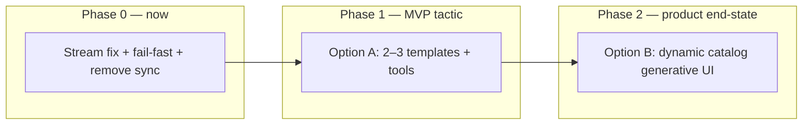

# ADR 001: Streaming A2UI Surface Generation (Option A vs Option B)

| Status | Draft |
|--------|-------|
| Date | 2026-05-25 |
| Deciders | spring-a2ui maintainers |

## Clarification: dynamic A2UI is the product; Option A is the MVP bootstrap

**A2UI is not a template-only system.** The [standard v0.8 catalog](https://a2ui.org/specification/v0_8/standard_catalog_definition.json) defines a **component vocabulary and message shapes** so an LLM (or app logic) can compose UI from scratch — adjacency lists, BoundValues, and lifecycle envelopes — without pre-built page templates.

The previous feature-branch approach attempted this (dynamic generative UI) but failed because of **implementation**, not because the goal was wrong:

| Failed approach | Correct dynamic approach (Option B) |
|-----------------|-------------------------------------|
| Monolithic `A2UiLlmOutput` + `.entity()` | One envelope per parse unit (JSONL / shallow schema) |
| Sync `/a2ui/surface` | Stream-only SSE |
| Buffer full LLM response before emit | Incremental envelope forwarding |
| Silent fallback text surface | Fail-fast SSE `event: error` |

**Option A (templates)** is a **short MVP tactic** (~days) to prove streaming, validation, and error handling while building toward **Option B (dynamic schema)** as the **long-term product** — true generative UI from the catalog alone, analogous to CopilotKit [dynamic schema](https://docs.copilotkit.ai/google-adk/generative-ui/a2ui/dynamic-schema) and the original spring-a2ui vision.

Option A does not replace Option B. Phase 1 builds trust; Phase 2 delivers the generative runtime developers should prefer.

---

## Context

spring-a2ui is an OSS Spring backend runtime for [A2UI v0.8](https://a2ui.org/). The end goal is to become the **preferred runtime for app developers** building generative UI applications — predictable enough for product/design expectations, not just demo novelty.

We failed to ship reliable UI generation with a **monolithic LLM contract** (`A2UiLlmOutput` + `.entity()` / full-response buffering). Sync `/a2ui/surface` is being removed; **A2UI-native SSE** is the only generation transport (no AG-UI, no A2A for now).

A2UI’s wire model is already incremental:

1. `surfaceUpdate` — flat component graph (structure)
2. `dataModelUpdate` — bound state (hydration)
3. `beginRendering` — commit signal

The open question is **who produces each envelope** and **how much the LLM invents vs selects**.

---

## Decision drivers

- App developers need **design-system-aligned, testable** surfaces.
- MVP must render **basic/simple UIs reliably** before supporting arbitrary prompts.
- Streaming must emit SSE events **progressively**, not after a full JSON blob completes.
- Failures must be **visible** (diagnostics), not masked by fallback text surfaces. **Decided: fail-fast only; no demo fallback.**
- Consumers will eventually **register their own surfaces**; MVP ships a **standard template set**.

---

## Options considered

### Option A — Template-driven (fixed schema)

**Flow:**

```
User message
  → Orchestrator LLM (+ tools)
  → selectSurfaceTemplate("weather-card" | "login-form" | …)
  → Tool fills slots (small typed args)
  → Runtime emits surfaceUpdate (from template) + dataModelUpdate + beginRendering over SSE
```

**Structure** comes from classpath JSON or Java builders — **not** from LLM layout generation.

| Pros | Cons |
|------|------|
| Deterministic layout matching design expectations | Needs a template per UX pattern |
| Tiny LLM output → fewer parse failures | “Any prompt” requires good intent→template routing |
| Fast first SSE frame | Less novelty for open-ended demos |
| Easy unit tests (builder/template in, messages out) | Template library maintenance |

**CopilotKit analogue:** [Fixed schema A2UI](https://docs.copilotkit.ai/google-adk/generative-ui/a2ui/fixed-schema) — agent tool returns data; schema is pre-authored.

---

### Option B — Multi-phase streaming (dynamic structure)

**Flow:**

```
User message
  → Phase 1: Planner (intent, surfaceId, optional templateHint)
  → Phase 2: Stream surfaceUpdate (JSONL lines / small structured chunks)
  → Phase 3: Stream dataModelUpdate lines
  → Phase 4: Runtime validates buffer → beginRendering
```

Each phase uses a **shallow schema** or JSONL line parser — never one nested catalog-wide DTO.

| Pros | Cons |
|------|------|
| Handles prompts with **no matching template** | Harder to guarantee design consistency |
| True progressive rendering | More moving parts (planner, parser, buffer) |
| Closer to “generative” marketing | Higher LLM failure rate on structure phase |
| Can patch/update surfaces incrementally | Harder for consumers to reason about output |

**CopilotKit analogue:** [Dynamic schema](https://docs.copilotkit.ai/google-adk/generative-ui/a2ui/dynamic-schema) — still tool-driven and middleware-streamed, not one free-form JSON document.

---

### Option C — AG-UI transport wrapper

**Rejected.** We stay **A2UI-native SSE** (`event: surfaceUpdate`, etc.). No AG-UI event layer.

---

## Recommendation: phased delivery



### Phase 1 — Option A (small, focus now)

| Goal | Approach |
|------|----------|
| Prove streaming + validation work | 2–3 standard templates (`text-card`, `hero-cta`, `form-login`) |
| Minimal orchestrator | `selectTemplate` + `renderTemplate` tools → builders |
| Est. effort | Small if scoped tightly (~days) |

Templates are **not** the long-term product. They unblock the demo and library credibility while Phase 0 infra lands.

### Phase 2 — Option B (true generative UI, end-state)

| Goal | Approach |
|------|----------|
| LLM composes UI from catalog alone | Incremental `surfaceUpdate` → `dataModelUpdate` → `beginRendering` over SSE |
| No page templates required | Catalog = vocabulary; LLM = layout + data |
| Correct prior failure mode | JSONL / shallow per-envelope parsing — never monolithic `A2UiLlmOutput` |

Option B is the **generative runtime** app developers should prefer for open-ended prompts. Option A remains available for predictable, design-system-aligned surfaces (CopilotKit fixed-schema path).

### Coexistence after Phase 2

Runtime supports both modes (property or request flag):

- **`template`** — Option A for known UX patterns
- **`dynamic`** — Option B default for catalog-driven generative UI

---

## Tool API shape (decision)

### Evaluated alternatives

| Approach | LLM-facing | Consumer-facing | Verdict |
|----------|------------|-----------------|---------|
| `@Tool` → `List<A2UiMessage>` | Yes | Leaks Spring AI + raw protocol | Too low-level for app authors |
| Fluent builder only (`A2UiSurfaces.weatherCard(...)`) | No | Excellent ergonomics | Not callable by LLM without wrapper |
| **Hybrid: Builder + thin `@Tool` adapters** | Yes (runtime-owned tools) | Yes (builders/templates) | **Selected** |

### Selected pattern: **Builder for authors, `@Tool` for orchestration**

**1. Core / web-starter — template & builder API (consumer-facing eventually)**

```java
// Classpath template or fluent builder — fully tested, no LLM
A2UiSurfaceSpec spec = A2UiSurfaceTemplates.weatherCard()
    .city("Istanbul")
    .temperature("18°C")
    .condition("Cloudy")
    .build();

List<A2UiMessage> messages = spec.toMessages(catalogId, surfaceId);
```

- Type-safe, IDE-friendly, unit-testable.
- Matches how app developers think (“I need a weather card”), not A2UI adjacency lists in prompts.
- Future **consumer registration**: `A2UiTemplateRegistry.register("my-checkout", MyTemplates::checkout)`.

**2. Runtime — Spring AI `@Tool` methods (orchestration only)**

```java
@Tool(description = "Render a registered surface template. templateId must be a known template.")
public void renderTemplate(
    @ToolParam(description = "Registered template id, e.g. weather-card") String templateId,
    @ToolParam(description = "JSON map of slot values") Map<String, Object> slots,
    ToolContext ctx) {
    a2UiStreamEmitter.emit(registry.render(templateId, slots, ctx));
}
```

- LLM sees **small, documented parameters** — not the full A2UI catalog schema.
- Tools delegate to builders/templates; they do not construct arbitrary component trees in prompt text.
- Consumers **do not** have to write `@Tool` for MVP; they register templates. Optional `@Tool` exposure can come later for power users.

**Why not `@Tool` returning `List<A2UiMessage>` as the public API?**

- Couples every app author to Spring AI annotations and raw protocol types.
- Hard to version, document, and validate compared to named templates with slot schemas.
- Builders remain usable in action handlers, tests, and non-LLM code paths.

---

## Transport & endpoints

- **Keep:** `POST /a2ui/surface/stream` (SSE), `POST /a2ui/actions`, catalog endpoints.
- **Remove:** `POST /a2ui/surface` (sync).
- **SSE events:** raw A2UI envelopes (`surfaceUpdate`, `dataModelUpdate`, `beginRendering`, `deleteSurface`, `done`, `error`).
- **No AG-UI.** No A2A extension transport in this ADR.

---

## Implementation scope

### Phase 0 + Phase 1 (now)

1. Remove sync endpoint and monolithic `A2UiLlmOutput` generation path.
2. Restore incremental SSE emission; fail-fast on errors (no fallback).
3. Ship **minimal template pack** (2–3 templates) + registry + builder + orchestrator tools.
4. Wire `A2UiSurfaceBuffer` before `beginRendering`.

### Phase 2 (next)

1. Wire `A2UiMessageParser` for incremental envelope streaming from LLM.
2. Dynamic prompt + catalog vocabulary (wire-format JSONL envelopes).
3. Shallow per-envelope structured output if needed — not catalog-wide DTO.
4. Bounded validation retry; dynamic mode as default for open-ended generation.
5. Option A templates remain for predictable UX alongside dynamic mode.

See [`BACKLOG.md`](../BACKLOG.md) for task breakdown.

---

## Consequences

### Positive

- Aligns with A2UI spec and CopilotKit’s production-proven fixed-schema path.
- Gives app developers a clear extension point (templates) without prompt engineering.
- MVP path is short: templates + tools + stream fix.

### Negative

- Open-ended prompts won’t work until Phase 2 (Option B) ships.
- Phase 1 template library is throwaway curation if scoped minimally (acceptable).

### Risks

- Intent→template misclassification in Phase 1 → wrong UI. Mitigate with small template enum + fail-fast error, not silent fallback.
- Phase 2 dynamic generation remains harder than templates — incremental parsing and validation are mandatory.

---

## Open items

None — provider scope decided **OpenAI-first** for MVP; multi-provider parity deferred.

---

## References

- [A2UI v0.8 protocol](https://a2ui.org/)
- [CopilotKit fixed schema A2UI](https://docs.copilotkit.ai/google-adk/generative-ui/a2ui/fixed-schema)
- [CopilotKit dynamic schema A2UI](https://docs.copilotkit.ai/google-adk/generative-ui/a2ui/dynamic-schema)
- Internal: `RESEARCH_NOTES.md`, `BACKLOG.md`
