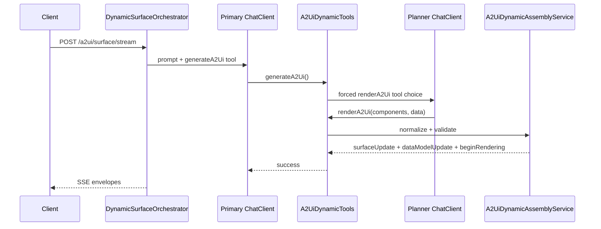

# Dynamic Generative UI (Phase 2)

spring-a2ui supports two surface generation modes. Both emit **A2UI v0.8 wire envelopes** over the same SSE endpoint (`POST /a2ui/surface/stream`).

## Template vs dynamic

| Mode | Property | Behavior |
|------|----------|----------|
| **Template** | `a2ui.web.runtime.generation-mode=template` | LLM selects a registered template (`selectTemplate`) and fills slots (`renderTemplate`). Fixed adjacency lists authored in the runtime. |
| **Dynamic** (library default) | `a2ui.web.runtime.generation-mode=dynamic` | LLM composes a surface from the standard v0.8 catalog alone via two-hop tools — no page templates. |

The showcase app defaults to the `template` Spring profile for predictable demos; set the property explicitly in your own application.

## A2UI v0.8 contract

Dynamic mode always produces the same envelope sequence as template mode:

1. `surfaceUpdate` — flat adjacency-list components
2. `dataModelUpdate` (optional) — plain JSON values bound to the surface data model
3. `beginRendering` — **emitted by the runtime**, never by the LLM

The runtime pins `catalogId` from request negotiation (`a2uiClientCapabilities.supportedCatalogIds`). Planner tool args may include a `surfaceId` hint; the negotiated client surface id wins.

Bound values use v0.8 shapes: `literalString`, `literalNumber`, `literalBoolean`, `literalArray`, or `path`.

## Two-hop tool flow

Dynamic generation uses a primary agent plus an inner planner (two-hop tools):



- **Primary agent** calls `generateA2Ui()` when a visual UI helps.
- **Planner** (second ChatClient inside `generateA2Ui`) must call `renderA2Ui` exactly once with flat planner-friendly component objects.
- **`A2UiDynamicComponentNormalizer`** converts flat args to v0.8 adjacency.
- **`responseFormat=NONE`** in dynamic mode — tool calling is incompatible with global `JSON_OBJECT`.

Session state travels via Spring AI **`ToolContext`** (never `ThreadLocal`).

## Validation retry

If assembled messages fail `A2UiMessageValidator`:

1. Diagnostics are captured from the validation failure.
2. The planner is invoked **once more** with diagnostics appended to the planner user prompt.
3. A second validation failure → `SurfaceExecutionException` with `A2UI_VALIDATION_FAILED` → SSE `event: error` (fail-fast, no fallback surface).

Unrelated errors (e.g. planner never calling `renderA2Ui`, transform failures) are **not** retried.

Micrometer counters (also via Actuator: `GET /actuator/metrics/<name>` when `metrics` is exposed):

| Metric | When |
|--------|------|
| `a2ui.dynamic.surface.generated` | Successful dynamic assembly |
| `a2ui.dynamic.validation.failed` | First validation failure (before retry) |
| `a2ui.dynamic.validation.retry.success` | Retry produced valid messages |
| `a2ui.dynamic.validation.retry.failed` | Retry still invalid or produced no surface |

## Running the showcase

The `be-transform-showcase` app ships Spring profiles:

```bash
# Template mode (default)
./mvnw -pl apps/be-transform-showcase spring-boot:run

# Dynamic mode
./mvnw -pl apps/be-transform-showcase spring-boot:run -Dspring-boot.run.arguments="--spring.profiles.active=dynamic"
```

Profile files:

- `application-template.yml` — `generation-mode: template`
- `application-dynamic.yml` — `generation-mode: dynamic`

Base `application.yml` sets `spring.profiles.default: template`.

## Frontend demo toggle

The `fe-a2ui-demo` app reads `VITE_A2UI_GENERATION_MODE`:

```bash
# Template samples (default)
npm run dev

# Dynamic open-ended prompts + UI hint
VITE_A2UI_GENERATION_MODE=dynamic npm run dev
```

Start the backend with the matching profile so generation mode aligns on both sides.

## Error diagnostics

SSE error events include `errorCode` and message. Validation failures use `A2UI_VALIDATION_FAILED`. The runtime does not emit partial or fallback surfaces on error.

Example:

```
event: error
data: {"error":"Dynamic surface failed validation","errorCode":"A2UI_VALIDATION_FAILED"}
```

## Further reading

- [Getting started](getting-started.md) — dependency to first SSE stream
- [REST API](../rest-api.md) — stream endpoint and configuration
