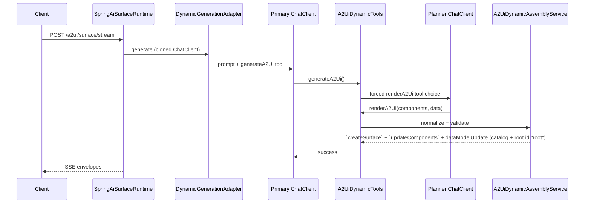

# Dynamic Generative UI (Phase 2)

spring-a2ui supports two surface generation modes so product builders can choose catalog compose vs registered-spec fill without inventing their own compose → validate → stream path. Both emit **A2UI v0.9.1 wire envelopes** over the same SSE endpoint (`POST /a2ui/surface/stream`). See also [Migrating to v0.9.1](migrating-to-v0.9.1.md). **When to use which:** [ADR 002](../adr/002-in-product-surfaces.md).

## Template vs dynamic

| Mode | Property | Behavior |
|------|----------|----------|
| **Template** | `a2ui.web.runtime.generation-mode=template` | LLM selects a **host-registered** template (`selectTemplate`) and fills slots (`renderTemplate`). Fixed adjacency lists — register templates via the [Template SPI](authoring-templates.md). The library ships none. |
| **Dynamic** (library default) | `a2ui.web.runtime.generation-mode=dynamic` | LLM composes a surface from the **active** catalog via two-hop tools — no page templates. Default active catalog is the vendored **basic** v0.9 catalog; hosts can register additional catalogs via `A2UiCatalogContribution` (see [registering catalogs](registering-catalogs.md)). |

The showcase streams **dynamic** for the composed slot (`mig-311`). The next step (approval) and other known trees use host `assemble` (no model). Template mode remains available as a frozen capability; do not demo both modes as two prints of the same form.

**Catalog note:** A2UI production apps typically define catalogs that match their design system ([a2ui.org](https://a2ui.org/guides/defining-your-own-catalog/)). spring-a2ui owns validate/generate against registered schemas; hosts author schemas + FE renderers and register them with `A2UiCatalogContribution`. See [registering catalogs](registering-catalogs.md) and [catalog ownership](../platform.md#catalog-ownership-a2ui-aligned).

## A2UI v0.9.1 contract

Dynamic mode always produces the same envelope sequence as template mode:

1. `createSurface` — surface id + catalogId (runtime)
2. `updateComponents` — flat adjacency-list components (`"component":"Text"` + sibling props); root id must be `"root"`
3. `updateDataModel` (optional) — `path` + JSON `value`

The runtime pins `catalogId` from request negotiation (`a2uiClientCapabilities.supportedCatalogIds`). Planner tool args may include a `surfaceId` hint; the negotiated client surface id wins.

Dynamic values are native JSON or `{"path":"/..."}` — not BoundValue wrappers.

## Two-hop tool flow

Dynamic generation uses a primary agent plus an inner planner (two-hop tools):


```mermaid
sequenceDiagram
    participant Client
    participant Compose as SpringAiSurfaceRuntime
    participant Adapter as DynamicGenerationAdapter
    participant Primary as Primary ChatClient
    participant Tools as A2UiDynamicTools
    participant Planner as Planner ChatClient
    participant Assembly as A2UiDynamicAssemblyService

    Client->>Compose: POST /a2ui/surface/stream
    Compose->>Adapter: generate (cloned ChatClient)
    Adapter->>Primary: prompt + generateA2Ui tool
    Primary->>Tools: generateA2Ui()
    Tools->>Planner: forced renderA2Ui tool choice
    Planner->>Tools: renderA2Ui(components, data)
    Tools->>Assembly: normalize + validate
    Assembly-->>Tools: `createSurface` + `updateComponents` + dataModelUpdate (catalog + root id "root")
    Tools-->>Primary: success
    Compose-->>Client: SSE envelopes
```

- **Primary agent** calls `generateA2Ui()` when a visual UI helps.
- **Planner** (second ChatClient inside `generateA2Ui`) must call `renderA2Ui` exactly once with flat planner-friendly component objects.
- Both tools are **one-shot** (`returnDirect`): Spring AI executes the forced tool and returns to the caller. It does not send the success string back under the same `tool_choice`, which would force the model to call the same tool again.
- **`A2UiDynamicComponentNormalizer`** converts flat args to flat v0.9.1 `ComponentDefinition`s (thin sanitize only).
- **`responseFormat=NONE`** in dynamic mode — tool calling is incompatible with global `JSON_OBJECT`.

Session state travels via Spring AI **`ToolContext`** (never `ThreadLocal`).

## Planner system prompt assembly

Dynamic mode builds the planner system prompt in two layers:

| Layer | Contents |
| ----- | -------- |
| **Static prefix** | Hard requirements, compact component digest (`required:` / `allowed:` per type), catalog rules text, optional host examples |
| **Dynamic suffix** | User content and context hints for this request |

The `renderA2Ui` tool schema remains the structural constraint on planner
output. Few-shot shapes are host-owned via `examplesText()` on
`A2UiCatalogContribution` (the vendored basic catalog ships none). Hosts may
also add domain prose via `A2UiGenerationContextContributor` beans — not by
extending core catalog types with selection metadata. The runtime does not dump
full catalog JSON into the prompt.

## Validation retry

If assembled messages fail `A2UiMessageValidator`, or adjacency checks in the
dynamic normalizer (unknown child ids, cycles, duplicate ids):

1. Diagnostics are captured from the validation failure.
2. The planner is invoked **once more** with diagnostics appended to the planner user prompt.
3. A second validation failure → `SurfaceExecutionException` with `A2UI_VALIDATION_FAILED` → SSE `event: error` (fail-fast, no fallback surface).

Unrelated errors (e.g. planner never calling `renderA2Ui`, parse/transform failures) are **not** retried.

Micrometer counters (also via Actuator: `GET /actuator/metrics/<name>` when `metrics` is exposed):

| Metric | When |
|--------|------|
| `a2ui.dynamic.surface.generated` | Successful dynamic assembly |
| `a2ui.dynamic.validation.failed` | First validation failure (before retry) |
| `a2ui.dynamic.validation.retry.success` | Retry produced valid messages |
| `a2ui.dynamic.validation.retry.failed` | Retry still invalid or produced no surface |
| `a2ui.generation.context.chars` | Planner static-prefix character length (digest + rules + examples) |

## Running the showcase

The `be-transform-showcase` app defaults to **dynamic** (one composed record,
then host-assembled approval). `application-template.yml` is a
frozen-capability smoke, not the hero.

```bash
# Dynamic slot demo (default)
./mvnw -pl apps/be-transform-showcase spring-boot:run

# Template mode (optional smoke)
./mvnw -pl apps/be-transform-showcase spring-boot:run -Dspring-boot.run.arguments="--spring.profiles.active=template"
```

Profile files:

- `application.yml` — `spring.profiles.default: dynamic`
- `application-template.yml` — `generation-mode: template`
- `application-dynamic.yml` — `generation-mode: dynamic`

## Frontend demo toggle

The `fe-a2ui-demo` app reads `VITE_A2UI_GENERATION_MODE` (default `dynamic`):

```bash
npm run dev

# Template smoke
VITE_A2UI_GENERATION_MODE=template npm run dev
```

Start the backend with the matching profile so generation mode aligns on both sides.

## Error diagnostics

SSE error events include `errorCode` and message. Validation failures use `A2UI_VALIDATION_FAILED`. The runtime does not emit partial or fallback surfaces on error.

Example:

```
event: error
data: {"error":"Dynamic surface failed validation","errorCode":"A2UI_VALIDATION_FAILED"}
```

## Further reading

- [Getting started](getting-started.md) — dependency to first SSE stream
- [REST API](../rest-api.md) — stream endpoint and configuration
