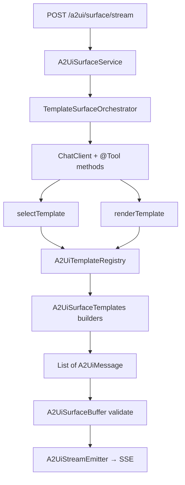

# Implementation Plan: Phase 1 — Option A Template MVP

**Audience:** Implementation agent  
**Prerequisite:** Phase 0 complete on branch from `main` (see [`phase-0-stream-infra.md`](phase-0-stream-infra.md))  
**ADR:** [`docs/adr/001-streaming-surface-generation.md`](../adr/001-streaming-surface-generation.md)  
**Backlog:** [`BACKLOG.md`](../../BACKLOG.md) — Phase 1 section  

---

## Goal

Prove the runtime end-to-end with **deterministic, design-aligned surfaces**: LLM selects a template and fills slots via tools; Java builders emit validated A2UI envelopes over SSE.

This is a **short MVP tactic**, not the long-term product. Phase 2 will add dynamic catalog generative UI (LLM composes layout from `standard-v0.8.json` alone).

---

## Non-negotiable decisions

| Topic | Decision |
|-------|----------|
| Templates (MVP) | **3 only:** `text-card`, `hero-cta`, `form-login` |
| Tool API | **Hybrid:** builders for authors + runtime `@Tool` for LLM |
| Consumer registration | **Later** — MVP ships standard templates only |
| Transport | Stream-only SSE (Phase 0) |
| Errors | Fail-fast (Phase 0) |
| LLM | OpenAI-first via existing `ChatClient` + `DeterministicOptionsAdvisor` |
| Public consumer API | `A2UiSurfaceTemplates` / `A2UiSurfaceSpec` — **not** `@Tool → List<A2UiMessage>` |

---

## Architecture



**Envelope sequence per render:**

1. `surfaceUpdate` — fixed adjacency list from template
2. `dataModelUpdate` — slot values from tool args (if any bound paths)
3. `beginRendering` — emitted by runtime after buffer validates root + child IDs

---

## Tasks

### 1.1 — Core template model

**New classes** (package suggestion: `...webstarter.template` or `...webstarter.surface`):

| Class | Responsibility |
|-------|----------------|
| `A2UiSurfaceSpec` | Immutable spec: produces `List<A2UiMessage>` for a `surfaceId` + `catalogId` |
| `A2UiSurfaceTemplates` | Fluent builders: `.textCard()`, `.heroCta()`, `.formLogin()` |
| `A2UiTemplateRegistry` | Load/register templates by ID; MVP loads 3 standard entries |
| `A2UiTemplateDefinition` | Optional: metadata (id, description, slot schema for tool docs) |

**Classpath templates (optional):** `META-INF/a2ui/templates/{id}.json` — or pure Java builders for MVP speed.

**Each template must:**

- Use only [standard v0.8 catalog](packages/a2ui-runtime-core/src/main/resources/META-INF/a2ui/catalogs/standard-v0.8.json) component types
- Use flat adjacency list with stable component IDs
- Pass `A2UiMessageValidator.validate()` in unit tests

#### Template specs (minimum)

**`text-card`**

- Column or Card → Text (title, usageHint h2) + Text (body)
- Slots: `title`, `body`

**`hero-cta`**

- Column → Text (heading) + Text (subtitle) + Button → Text label child
- Button `action.name`: e.g. `primary_action`
- Slots: `heading`, `subtitle`, `buttonLabel`, optional `actionName`

**`form-login`**

- Column → Text (title) + TextField (username) + TextField (password, obscured) + Button (submit)
- Slots: `title`, `usernameLabel`, `passwordLabel`, `submitLabel`

### 1.2 — Surface buffer integration

Before emitting `beginRendering`:

- Feed `surfaceUpdate` messages into `A2UiSurfaceBuffer` (core module)
- Validate `beginRendering.root` references known component ID
- Optional: validate `Button.child`, `children.explicitList` reference defined IDs

Extract buffer wiring into a small service, e.g. `A2UiSurfaceAssemblyService`.

### 1.3 — Stream emitter

**New:** `A2UiStreamEmitter` (or orchestrator-owned helper)

- Accepts validated `List<A2UiMessage>` or single message
- Used by template path to push into existing `Flux<A2UiMessage>` pipeline
- Runtime emits `beginRendering` last (runtime-owned, not LLM)

### 1.4 — Template orchestrator (OpenAI-first)

**New:** `TemplateSurfaceOrchestrator` implements `A2UiSurfaceRuntime` **or** wraps/replaces JSONL LLM path for MVP mode.

MVP approach (simplest):

- Property: `a2ui.web.runtime.generation-mode=template` (default for showcase)
- When `template`: skip JSONL LLM layout generation; run tool-calling orchestrator instead
- Keep JSONL path behind `dynamic` mode for Phase 2

**Spring AI tools** (runtime-owned beans):

```java
@Tool(description = "Select a surface template. Must be one of: text-card, hero-cta, form-login")
String selectTemplate(String templateId, String rationale);

@Tool(description = "Render the selected template with slot values")
void renderTemplate(String templateId, Map<String, String> slots);
```

- `selectTemplate` / `renderTemplate` delegate to `A2UiTemplateRegistry`
- ChatClient call with `AdvisorParams` / default advisors (temperature 0, JSON_OBJECT if needed for tool args only — not full UI tree)
- OpenAI model from `spring.ai.openai.chat.options.model`

**Orchestrator flow:**

1. User content → ChatClient with tools
2. Model calls `renderTemplate("text-card", {title, body})`
3. Registry builds `A2UiSurfaceSpec` → messages
4. Buffer validates → append `beginRendering`
5. Return `Flux.fromIterable(messages)` or emit via stream pipeline

### 1.5 — Wire into existing stack

| Component | Change |
|-----------|--------|
| `A2UiWebAutoConfiguration` | Register registry, orchestrator, tools, `A2UiSurfaceBuffer` usage |
| `SpringAiSurfaceRuntime` | Delegate to template orchestrator when mode=template; keep JSONL path for mode=dynamic |
| `A2UiSurfaceService` | Unchanged if runtime returns correct Flux |
| `A2UiStreamController` | Unchanged |
| `DefaultA2UiPromptProvider` | Template mode: short system prompt listing templates + slot fields; not full catalog JSON |

### 1.6 — Demo & showcase

- `apps/be-transform-showcase`: `a2ui.web.runtime.generation-mode=template`
- `apps/fe-a2ui-demo`: stream-only (Phase 0); verify all 3 templates render via natural language prompts
- Document example prompts in showcase README or `.env.example`

### 1.7 — Tests

**Unit:**

- `A2UiSurfaceTemplatesTest` — each template → `validate()` empty diagnostics
- `A2UiTemplateRegistryTest` — lookup by id, unknown id throws

**Integration:**

- Mock `ChatClient` → tool calls `renderTemplate` → SSE events include `surfaceUpdate` then `beginRendering`
- End-to-end optional with `@MockBean` ChatModel

**Metrics (optional MVP):**

- `a2ui.template.rendered` counter with templateId tag

### 1.8 — Verify

```bash
mvn test -pl packages/a2ui-runtime-spring-web-starter,apps/be-transform-showcase -am
```

Manual: run showcase + fe demo, prompt e.g. “Show a login form” → renders `form-login` template.

---

## Acceptance criteria

- [ ] 3 templates registered and render valid A2UI over SSE
- [ ] LLM path uses `@Tool` with small slot args — **no** full UI JSON from model
- [ ] `beginRendering` only after buffer/validator pass
- [ ] Fail-fast on unknown template ID or invalid slots
- [ ] `generation-mode=template` default in showcase
- [ ] JSONL dynamic path preserved behind `generation-mode=dynamic` for Phase 2
- [ ] Tests pass

---

## Out of scope

- Consumer `A2UiTemplateRegistry.register()` SPI (Later backlog)
- Additional templates (`weather-card`, `metric-row`, …)
- Phase 2 dynamic generative UI prompt/parser work
- Multi-provider customizers beyond OpenAI-first
- Removing `llm/*` package — should not exist if starting from `main`

---

## File layout (expected after Phase 1)

```
packages/a2ui-runtime-spring-web-starter/src/main/java/.../webstarter/
  template/
    A2UiSurfaceSpec.java
    A2UiSurfaceTemplates.java
    A2UiTemplateRegistry.java
    A2UiTemplateDefinition.java
  surface/
    A2UiSurfaceAssemblyService.java    # buffer + beginRendering
    A2UiStreamEmitter.java             # optional helper
  runtime/
    TemplateSurfaceOrchestrator.java
    SpringAiSurfaceRuntime.java          # mode switch
  tool/
    A2UiTemplateTools.java             # @Tool methods

packages/a2ui-runtime-spring-web-starter/src/test/java/.../
  template/A2UiSurfaceTemplatesTest.java
  runtime/TemplateSurfaceOrchestratorTest.java
  integration/A2UiTemplateStreamIntegrationTest.java

META-INF/a2ui/templates/               # optional JSON; Java builders OK for MVP
```

---

## Relationship to Phase 2

Phase 1 proves: SSE pipeline, validation, buffer, fail-fast, OpenAI tool orchestration.

Phase 2 switches `generation-mode=dynamic` to JSONL incremental envelopes from LLM using catalog vocabulary — reusing the same emitter, buffer, validator, and stream controller.

Do **not** reintroduce `A2UiLlmOutput` monolithic DTO for Phase 2.
