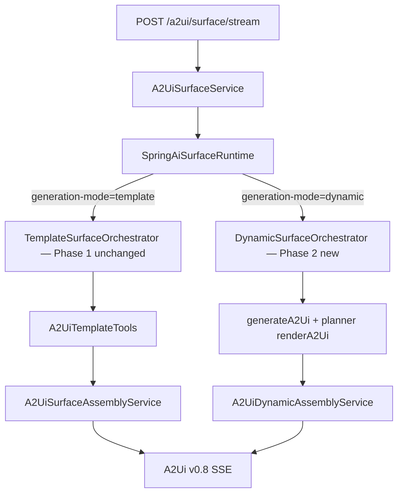
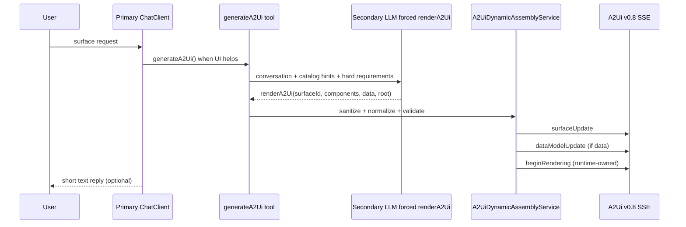
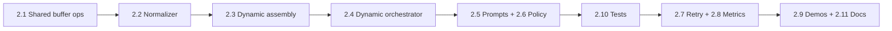

# Implementation Plan: Phase 2 — Dynamic Generative UI (Option B)

**Audience:** Implementation agent  
**Prerequisite:** Phase 0 + Phase 1 merged on `main` (see [`phase-0-stream-infra.md`](phase-0-stream-infra.md), [`phase-1-template-mvp.md`](phase-1-template-mvp.md))  
**ADR:** [`docs/adr/001-streaming-surface-generation.md`](../adr/001-streaming-surface-generation.md)  
**Backlog:** [`BACKLOG.md`](../../BACKLOG.md) — Phase 2 section  

**Orchestration pattern:** two-hop tools — primary agent decides *when* UI helps; secondary structured call decides *what* (`generateA2Ui` → forced `renderA2Ui`).

---

## Goal

Deliver **true generative UI** on **A2UI v0.8 only**: the LLM composes surfaces from the [standard v0.8 catalog](packages/a2ui-runtime-core/src/main/resources/META-INF/a2ui/catalogs/standard-v0.8.json) via a **structured tool pipeline**, emitting validated **v0.8 wire envelopes** over native SSE.

Phase 2 is the long-term product end-state (Option B). **Phase 1 (Option A) must remain fully supported** — same endpoint, same tests, same showcase profile — selected by `generation-mode`, not by replacing template code paths.

**Out of scope for Phase 2:** A2UI v0.9 operations (`createSurface`, `updateComponents`, `updateDataModel`). We may add v0.9 translation later without breaking v0.8 clients.

---

## Coexistence contract (Phase 1 must not regress)

Phase 2 adds **parallel orchestration**, not a rewrite.

| Concern | Rule |
|---------|------|
| Mode switch | `SpringAiSurfaceRuntime.stream()` branches on `a2ui.web.runtime.generation-mode`: `template` → existing `TemplateSurfaceOrchestrator`; `dynamic` → new `DynamicSurfaceOrchestrator` |
| Phase 1 classes | **Do not modify** `A2UiTemplateTools`, `TemplateSurfaceOrchestrator`, `A2UiSurfaceAssemblyService`, `A2UiTemplateRegistry`, or template builders except shared extractions (e.g. buffer helper) that both paths call |
| Phase 1 tests | All `TemplateSurfaceOrchestratorTest`, `A2UiTemplateStreamIntegrationTest`, template unit tests **must stay green** without changing expectations |
| Showcase default | May keep `generation-mode=template` until dynamic is stable; library default can remain `dynamic` |
| Shared infra | Phase 0 pipeline (`A2UiSurfaceService`, `A2UiStreamController`, fail-fast validation, SSE) is shared; dynamic adds orchestrator + assembly only |
| Tool naming | Phase 1: `selectTemplate` / `renderTemplate`. Phase 2: `generateA2Ui` / internal `renderA2Ui` planner tool — **different tools, no overlap** |



---

## Positioning: two-hop pattern vs spring-a2ui choices

We use a **two-hop orchestration pattern** (primary agent decides *when*; secondary structured call decides *what*) because it matches how A2UI runtimes should behave. Choices below are spring-a2ui product constraints.

| Topic | spring-a2ui Phase 2 choice | Rationale |
|-------|----------------------------|-----------|
| Protocol version | **v0.8 wire envelopes** (`surfaceUpdate`, `dataModelUpdate`, `beginRendering`) | `@a2ui/react` demo + validator target v0.8; v0.9 later |
| Transport | **Native A2UI SSE** (`A2UiStreamController`) | ADR: A2UI-native only |
| Catalog source | **Server `standard-v0.8.json`** + request negotiation | Host-app runtime owns catalog |
| Dynamic mechanism | **Two-hop tools:** `generateA2Ui` → forced `renderA2Ui` via Spring AI `@Tool` | Structured reliability vs free-form JSONL |
| LLM output shape | Flat `{id, component: "Text", text: "..."}` in tool args → **normalize to v0.8 adjacency** in assembly | Validator + client expect spec wire format |
| `beginRendering` | **Runtime emits after buffer validation** | Stricter lifecycle; never trust planner |
| `catalogId` | **Pinned from request negotiation** | Prevent LLM hallucination |
| Fixed / template path | **Phase 1 templates** (Java builders + slot tools) | Already shipped; keep |
| Errors | **Fail-fast SSE `event: error` + diagnostics** | Phase 0 contract |
| JSONL chat stream | **Not primary**; optional experimental path behind flag later | Avoid two competing dynamic implementations |

---

## Target architecture (dynamic mode)



### Primary agent

- Instruction: when a rich visual helps, call **`generateA2Ui`** (no args); keep chat reply to one short sentence.
- Tools: **`generateA2Ui` only** for UI generation in dynamic demo — do not expose Phase 1 `selectTemplate` / `renderTemplate` on the same agent config (avoids tool-slot confusion).

### Secondary planner (inside `generateA2Ui`)

- Separate `ChatClient` call with **forced tool choice** → `renderA2Ui`.
- Tool parameters:

  | Param | Type | Notes |
  |-------|------|-------|
  | `surfaceId` | string | kebab-case, e.g. `kpi-dashboard` |
  | `components` | array | Flat planner-friendly entries; normalized to v0.8 before emit |
  | `root` | string | Must exist in `components`, typically `"root"` |
  | `data` | object | Plain JSON; assembly converts to `dataModelUpdate` contents |

- **`catalogId` is NOT trusted from the LLM** — inject from `A2UiRequestCatalogNegotiator` / request capabilities (pin per request).

### Assembly → v0.8 SSE (our unique layer)

New: **`A2UiDynamicAssemblyService`**

1. **Sanitize** components:
   - Drop entries missing `id` or `component`
   - Require `root` id present
   - Unstringify JSON-as-string fields (`data`, etc.)
2. **Normalize** flat planner components → v0.8 adjacency list (`A2UiDynamicComponentNormalizer`)
3. **Build messages:**
   - `surfaceUpdate` with normalized components
   - `dataModelUpdate` from plain `data` object (typed contents conversion)
   - **`beginRendering`** — runtime only, after `A2UiSurfaceBuffer` + `A2UiMessageValidator.validate()`
4. Return `Flux<A2UiMessage>` or `List<A2UiMessage>` for existing stream pipeline

Reuse **`A2UiSurfaceBuffer`** via shared helper extracted from `A2UiSurfaceAssemblyService` (both template and dynamic call it — extraction must not change template behavior).

---

## What already exists (build on, do not replace)

| Asset | Location | Phase 2 use |
|-------|----------|-------------|
| Stream-only SSE + fail-fast | `A2UiStreamController`, `A2UiSurfaceService` | Shared |
| `generation-mode` switch | `A2UiWebProperties`, `SpringAiSurfaceRuntime` | Branch only; add dynamic orchestrator |
| Template path (Phase 1) | `TemplateSurfaceOrchestrator`, `A2UiTemplateTools` | **Untouched** |
| Buffer + runtime BR (template) | `A2UiSurfaceAssemblyService` | Pattern + shared helper |
| `A2UiMessageValidator` | core | Both paths |
| `DefaultA2UiPromptProvider` | web-starter | Keep for optional JSONL experiment; **dynamic uses new `DynamicA2UiPromptProvider`** |
| Legacy `streamDynamic()` JSONL stub | `SpringAiSurfaceRuntime` | Replace with orchestrator delegation; JSONL code may move to `experimental` package or delete after orchestrator ships |

---

## Non-negotiable decisions

| Topic | Decision |
|-------|----------|
| Protocol | **A2UI v0.8 wire format only** for Phase 2 |
| Transport | A2UI-native SSE only |
| Coexistence | `template` and `dynamic` modes both supported; Phase 1 code paths preserved |
| Dynamic mechanism | **Two-hop tools** (`generateA2Ui` → forced `renderA2Ui`), not JSONL-as-primary |
| `beginRendering` | **Runtime emits** after buffer + validator — planner must not emit lifecycle commit |
| Validation | Fail-fast SSE `event: error` + diagnostics |
| Retry | One bounded retry on validation failure with diagnostic feedback to planner |
| Response format | `NONE` for dynamic tool calls — no global `JSON_OBJECT` |
| LLM | OpenAI-first via `ChatClient` + advisors |
| Catalog | Server-side `standard-v0.8.json`; optional catalog summary in planner prompt |

---

## Gap analysis (current codebase vs target)

| Gap | Current | Target |
|-----|---------|--------|
| Dynamic orchestration | Inline `streamDynamic()` JSONL stub | `DynamicSurfaceOrchestrator` + two-hop tools |
| Wire format | Prompt asks LLM for JSONL incl. `beginRendering` | Planner tool args → assembly → v0.8 envelopes |
| Normalization | None | Flat tool components → v0.8 adjacency |
| Buffer (dynamic) | None | Shared buffer helper + dynamic assembly |
| Phase 1 isolation | Shared runtime class | Strict branch; no template tool changes |
| Policy | Default `JSON_OBJECT` | `NONE` when `generation-mode=dynamic` |
| Tests | JSONL chunk unit test only | Dynamic orchestrator + integration + Phase 1 regression |

---

## Branch strategy

```bash
git checkout main
git pull
git checkout -b feat/dynamic-generative-ui
```

Implement in vertical slices. **Run Phase 1 test suite on every PR** with `generation-mode=template`.

---

## Tasks

### 2.1 — Shared surface assembly primitives (non-breaking)

Extract without changing template behavior:

| Task | Details |
|------|---------|
| `A2UiSurfaceBufferOps` | Static `apply(buffer, message)` shared by template + dynamic assembly |
| `SpringAiSurfaceRuntime.createClient()` | `chatClientBuilder.clone()` before advisors (match `TemplateSurfaceOrchestrator`) |
| Tests | Existing template + stream tests green |

**Acceptance:** Zero diff in template message sequences; only moved code.

---

### 2.2 — `A2UiDynamicComponentNormalizer`

Convert planner-friendly flat entries to v0.8 component objects.

Example input (flat planner style):

```json
{"id": "title", "component": "Text", "text": "Hello", "usageHint": "h2"}
```

Output (v0.8 wire):

```json
{"id": "title", "component": {"Text": {"text": {"literalString": "Hello"}, "usageHint": "h2"}}}
```

Rules:

- One catalog type per `component` key (already flat in planner input)
- Map shorthand string props → `BoundValue` literals where appropriate
- Preserve `children` / `child` id references (never inline nested component trees)
- Reject cyclic or self-referencing ids

**Acceptance:** Unit tests per component type in standard catalog; invalid graphs fail with clear diagnostics.

---

### 2.3 — `A2UiDynamicAssemblyService`

Assembles planner tool args into **v0.8 messages**:

```java
List<A2UiMessage> assemble(RenderA2UiArgs args, String catalogId, String negotiatedSurfaceId);
```

Steps:

1. Sanitize + normalize components
2. Apply `surfaceUpdate` to buffer
3. Convert `data` → `dataModelUpdate` (plain object → `contents` entries)
4. Validate buffer (root exists, ids resolve)
5. Append runtime `beginRendering(surfaceId, root, catalogId)`
6. Run full `messageValidator.validate(messages)`

**Acceptance:** Given fixture tool args, output passes `A2UiMessageValidator` and matches golden SSE sequence.

---

### 2.4 — `DynamicSurfaceOrchestrator`

New class: `...webstarter.runtime.DynamicSurfaceOrchestrator`

**Primary path** (blocking LLM, like Phase 1 template orchestrator):

```java
Mono.fromCallable(() -> { ... primary ChatClient with generateA2Ui tool ... })
    .subscribeOn(Schedulers.boundedElastic())
    .flatMapMany(Flux::fromIterable);
```

**Tools:**

| Tool | Visibility | Role |
|------|------------|------|
| `generateA2Ui` | Primary agent | Entry point; runs planner inside |
| `renderA2Ui` | Planner only (forced tool choice) | Returns structured layout + data |

**`generateA2Ui` implementation:**

1. Read conversation context from `ToolContext` / session
2. Build planner system prompt: hard requirements + catalog component names from `A2UiCatalogRegistry`
3. Secondary `ChatClient` call with `.tools(renderA2UiTool)` + forced tool choice
4. Pin `catalogId` from request; ignore planner value if present
5. Call `A2UiDynamicAssemblyService.assemble(...)`
6. Store result in `ToolContext` for primary agent summary (same pattern as Phase 1 `TemplateRenderSession`)

**Wire into `SpringAiSurfaceRuntime`:**

```java
if (isTemplateMode()) {
    return templateOrchestrator.stream(request, requestId, catalogId);
}
return dynamicOrchestrator.stream(request, requestId, catalogId);
```

Remove inline `streamDynamic()` once orchestrator is tested.

**Acceptance:** Mock planner tool call → SSE emits `surfaceUpdate`, optional `dataModelUpdate`, runtime `beginRendering`.

---

### 2.5 — Prompt providers

| Class | Used by | Content |
|-------|---------|---------|
| `TemplateModePromptProvider` | Phase 1 | **No changes** |
| `DynamicA2UiPromptProvider` | Phase 2 primary + planner | Hard requirements: root id, flat array, no empty `{}`, populate data props, chart vs card heuristics |
| `DefaultA2UiPromptProvider` | Legacy JSONL stub | Deprecate for dynamic default; keep or move to `experimental` |

Planner prompt must **not** ask for `beginRendering` or raw JSONL.

**Acceptance:** Snapshot tests for prompt strings; no `beginRendering` in planner instructions.

---

### 2.6 — Generation policy

When `a2ui.web.runtime.generation-mode=dynamic`:

- Set `responseFormat=NONE` on ChatOptions (tool calling incompatible with `JSON_OBJECT`)
- Template mode policy unchanged

**Acceptance:** Unit test on `A2UiGenerationPolicyService` or advisor wiring.

---

### 2.7 — Bounded validation retry

On assembly/validation failure:

1. Capture `A2UiDiagnostic` list
2. **One** replan attempt with diagnostics appended to planner prompt
3. Second failure → `SurfaceExecutionException` → SSE error

Do not retry mid-primary-agent turn for unrelated errors.

**Acceptance:** Test: invalid first planner response → valid second → successful SSE.

---

### 2.8 — Metrics

| Metric | When |
|--------|------|
| `a2ui.dynamic.surface.generated` | Successful dynamic assembly |
| `a2ui.dynamic.validation.failed` | Before retry |
| `a2ui.dynamic.validation.retry.success` / `.failed` | Retry outcome |
| `a2ui.template.rendered` | Phase 1 — unchanged |

---

### 2.9 — Mode selection & demos

| Task | Details |
|------|---------|
| Property | `a2ui.web.runtime.generation-mode=template\|dynamic` (exists) |
| Showcase | `application-template.yml` + `application-dynamic.yml` profiles |
| FE demo | Env toggle for dynamic open-ended prompts |
| Optional request override | Only if product needs per-request mode later |

**Regression:** Showcase template profile unchanged by default until dynamic is validated.

---

### 2.10 — Test coverage

| Test | Must pass |
|------|-----------|
| All Phase 1 tests | `generation-mode=template` |
| `A2UiDynamicComponentNormalizerTest` | Normalization edge cases |
| `A2UiDynamicAssemblyServiceTest` | Golden v0.8 sequences |
| `DynamicSurfaceOrchestratorTest` | Mock ChatClient + tool args |
| `A2UiDynamicStreamIntegrationTest` | `@SpringBootTest`, `generation-mode=dynamic` |
| `A2UiGenerationPolicyDynamicModeTest` | Policy disables JSON_OBJECT |

---

### 2.11 — Documentation

| Doc | Content |
|-----|---------|
| `docs/guides/dynamic-generative-ui.md` | When to use template vs dynamic, v0.8 contract, error diagnostics |
| `docs/rest-api.md` | Document `generation-mode` property |
| This plan + `BACKLOG.md` | Check off on completion |

---

## Suggested implementation order



**PR slice 1:** 2.1 + 2.2 + 2.3 + normalizer/assembly tests (no orchestrator yet; Phase 1 regression only).

**PR slice 2:** 2.4 + 2.5 + 2.6 + orchestrator tests — dynamic mode end-to-end with mocked LLM.

**PR slice 3:** 2.7 + 2.8 + 2.9 + 2.11 — retry, metrics, showcase dynamic profile, developer guide.

---

## Out of scope (Phase 2 MVP)

- **A2UI v0.9** ops container or translation layer
- **Generic agent↔app chat/event bridge** (optional later utilization work)
- **Client-injected catalogs** as the primary catalog source (server owns `standard-v0.8.json`)
- **JSONL chat stream as primary dynamic path** — defer to experimental flag if needed
- **Progressive per-tool-arg streaming** of surfaces — Phase 2.5+ optional
- **Action handler / optimistic UI swap** — later; template actions via existing `A2UiActionService`
- Multi-provider parity beyond OpenAI-first

---

## Definition of done

- [x] `generation-mode=dynamic` produces v0.8 SSE from planner tool args (mock + real LLM)
- [x] `generation-mode=template` unchanged; all Phase 1 tests green
- [x] Runtime emits `beginRendering`; planner never commits lifecycle
- [x] Flat planner components normalized to v0.8 adjacency
- [x] `catalogId` pinned from request negotiation
- [x] `JSON_OBJECT` not applied in dynamic mode
- [x] One validation retry with diagnostics
- [x] Dynamic metrics registered
- [x] Showcase dynamic profile + developer guide
- [x] `mvn test` green on affected modules

---

## References

- [A2UI v0.8 specification](https://a2ui.org/)
- Internal: [`phase-1-template-mvp.md`](phase-1-template-mvp.md), ADR 001
