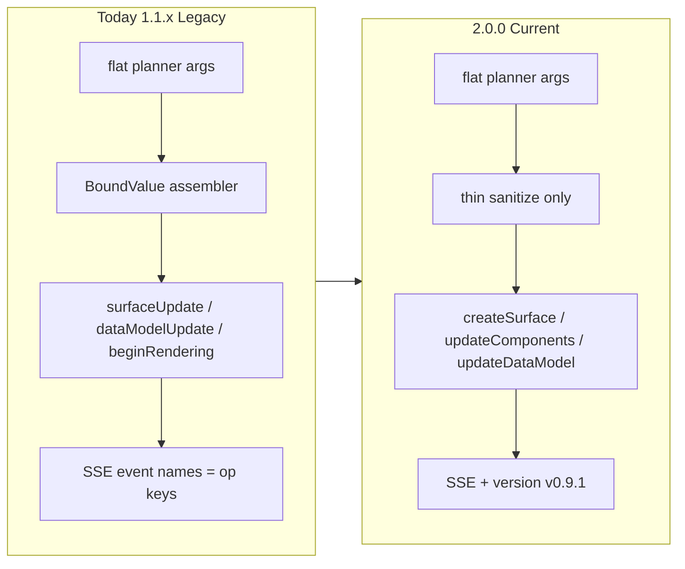

# Implementation Plan: Phase X — Migrating to A2UI v0.9.1

**Status:** Active — ready to implement  
**Prerequisite:** Phase 2.5 ✅ · Maven Central `1.1.0` ✅ · patch `1.1.1` ✅  
**Backlog:** [`BACKLOG.md`](../../BACKLOG.md) — Phase X section  
**Branch:** `feat/phase-x-v0.9.1`  
**Library SemVer:** **`2.0.0`** (breaking wire cutover). Legacy v0.8 stays on **`1.1.x`** patch-only.

---

## Problem statement

a2ui.org marks **v0.8 = Legacy** and **v0.9.1 = Current**. spring-a2ui `1.1.x` still speaks v0.8 (`surfaceUpdate` / BoundValue / `beginRendering`). Staying on Legacy after a successful Central publish undermines platform credibility before the utilization layer investment.

Frontier A2UI moved from **structured-output-first (v0.8)** to **prompt-first + validate + retry (v0.9+)**:

```
Prompt → Generate → Validate
  → if invalid: structured VALIDATION_FAILED (surfaceId, path, message) back to LLM
  → self-correct
```

That matches Phase 2.5’s end state (thin assemble + strict validate + retry). v0.9.1’s flatter wire **eliminates most of the BoundValue assembler**.

---

## Locked decisions

| Decision | Choice |
|----------|--------|
| Protocol target | **A2UI v0.9.1 Current** (emit `"version": "v0.9.1"`) |
| Cutover | **Hard cutover** on `2.0.0` — one wire in the artifact |
| Legacy line | Keep `1.1.x` for community renderers stuck on `@a2ui/react/v0_8` |
| Templates | **Migrate in lockstep** with dynamic (four MVP specs) |
| Transport | **A2UI-native SSE** remains identity (ADR 001) |
| Reliability | Sanitize (syntax) + catalog validate + bounded retry — **no semantic repair** |
| Dual protocol flag | **Not shipped** as a supported mode |

---

## Wire delta (v0.8 → v0.9.1)

| Topic | v0.8 (`1.1.x`) | v0.9.1 (`2.0.0`) |
|-------|----------------|------------------|
| Envelope version | Implicit / `SUPPORTED_VERSION="0.8"` | Required `"version": "v0.9.1"` |
| Lifecycle | `surfaceUpdate` → `dataModelUpdate` → `beginRendering` | `createSurface` → `updateComponents` → `updateDataModel` (+ `deleteSurface`) |
| Ready / catalog | `beginRendering.root` + optional `catalogId` | `createSurface.catalogId` required; root = component `id: "root"` |
| Components | `{"component":{"Text":{…}}}` | `"component":"Text"` + flat props |
| Values | `{literalString}` / typed BoundValue | Native JSON **or** `{"path":"…"}` |
| Children | `{explicitList:[…]}` | Bare ID arrays `["title"]` |
| Data model | Typed `contents[]` (`DataEntry`) | `path` + JSON `value` (omit value ⇒ delete) |
| Catalog | `standard-v0.8.json` | Vendored basic catalog + `rules.txt` |
| Client→server | `userAction` | `action` |
| MIME | `application/json+a2ui` | `application/a2ui+json` |
| Validation feedback | Our diagnostics | Protocol `VALIDATION_FAILED` for planner retry |

### Property / type renames (must not miss)

| Area | Old | New |
|------|-----|-----|
| Row / Column | `distribution` / `alignment` | `justify` / `align` |
| Modal | `entryPointChild` / `contentChild` | `trigger` / `content` |
| Tabs | `tabItems` | `tabs` |
| TextField | `text` / `textFieldType` | `value` / `variant` |
| Many | `usageHint` | `variant` |
| Button | `primary: true` | `variant: "primary"` |
| Choice | `MultipleChoice` | `ChoicePicker` |
| Slider | `minValue` / `maxValue` | `min` / `max` |
| Client message | `userAction` | `action` |

Sources: [v0.9 evolution guide](https://a2ui.org/specification/v0.9-evolution-guide/), [v0.9.1 protocol](https://a2ui.org/specification/v0.9.1-a2ui/), [v0.9→v0.9.1](https://a2ui.org/specification/v0.9.1-evolution-guide/).

---

## Architecture

### Current (`1.1.x`)

```
LLM renderA2Ui(flat components)
  → sanitize
  → A2UiDynamicComponentNormalizer (BoundValue + explicitList + nested type key)
  → SurfaceUpdate + DataModelUpdate + BeginRendering
  → A2UiMessageValidator + catalog schema
  → SSE event names = v0.8 op keys
```

### Target (`2.0.0`)

```
LLM renderA2Ui(flat components)  ← catalog-derived schema + rules.txt in prompt
  → sanitize (drop missing id/component; DAG fail — no invent)
  → thin flatten only (no BoundValue wrapping)
  → createSurface(catalogId) + updateComponents + updateDataModel
  → A2UiMessageValidator + v0.9.1 catalog schema
  → on fail: VALIDATION_FAILED → bounded planner retry
  → SSE (event names = v0.9.1 op keys; version on every envelope)
```



---

## Keep (structure)

- Two-hop tools (`generateA2Ui` → forced `renderA2Ui`)
- Fail-fast SSE `event: error` (no demo fallback)
- Bounded validation retry + metrics counters
- Template registry SPI shape
- ADR 001 A2UI-native SSE identity
- Ban on semantic repair (Phase 2.5c)

---

## Workstreams (PR slices)

### X.0 — Vendor schemas + SemVer note

**Goal:** Official v0.9.1 schemas on classpath; plan/docs state SemVer break.

**Tasks:**
1. Vendor from a2ui.org / Google A2UI repo:
   - `server_to_client.json`
   - `common_types.json`
   - `catalogs/basic/catalog.json`
   - `basic_catalog_rules.txt` (or equivalent rules fragment)
2. Place under `packages/a2ui-runtime-core/src/main/resources/META-INF/a2ui/` (schemas + catalogs).
3. Document: `2.0.0` = Current wire; `1.1.x` = Legacy only.

**Acceptance:** Schemas load from classpath; no invented catalog shapes.

---

### X.1 — Protocol + serialization

**Goal:** Core models speak v0.9.1 only.

**Hot files:**
- `A2UiMessage.java` — replace `SurfaceUpdate` / `DataModelUpdate` / `BeginRendering` with `CreateSurface` / `UpdateComponents` / `UpdateDataModel` (+ keep `DeleteSurface`)
- `ComponentDefinition` — `"component": "Text"` + flat props (drop single-key nested map)
- Delete or gut `BoundValue.java`, `DataEntry.java`
- `A2UiMessageSerializer` / `Deserializer` / `A2UiJacksonModule`
- `A2UiProtocol` — `SUPPORTED_VERSION = "v0.9.1"`, MIME `application/a2ui+json`
- `A2UiMessageParser`

**Tasks:**
1. Rewrite sealed message types; every envelope carries `version`.
2. Golden fixture: official contact-form JSONL from v0.9.1 protocol round-trips ser/de + parser.
3. Remove all v0.8 op key handling from core models.

**Acceptance:** Fixtures parse; no `surfaceUpdate` / `beginRendering` / BoundValue in core protocol models.

---

### X.2 — Catalog + validation + VALIDATION_FAILED

**Goal:** Catalog validation and sequence rules match v0.9.1; planner retry uses protocol error shape.

**Hot files:**
- `A2UiCatalogIds` — add/replace with basic v0.9.1 catalogId
- `A2UiCatalogRegistry` — load vendored basic catalog
- `A2UiCatalogController` / `A2UiCatalogService` — new HTTP route
- `A2UiMessageValidator` — create-before-update; require `id: "root"`; drop beginRendering sequence
- `A2UiCatalogSchemaValidator` — flat components + Dynamic* unions
- Dynamic tools retry path — emit `VALIDATION_FAILED` (`code`, `surfaceId`, `path`, `message`)

**Acceptance:** Invalid CheckBox / Button / Card fail before SSE; retry diagnostics match protocol fields.

---

### X.3 — Dynamic generation path

**Goal:** Dynamic mode emits v0.9.1 without BoundValue assembly or semantic repair.

**Hot files:**
- `A2UiDynamicComponentNormalizer` — shrink to sanitize + DAG fail
- `A2UiDynamicAssemblyService` — `createSurface` → `updateComponents` → `updateDataModel`
- `A2UiSurfaceBuffer` / `A2UiSurfaceBufferOps`
- `A2UiToolSchemaGenerator` — flat component schema
- `DynamicA2UiPromptProvider` — rules.txt + v0.9.1 examples
- `A2UiDynamicTools` — orchestration stays; assembly output changes

**Explicit ban:** no Card/Button/CheckBox invent-and-fix rules. Syntax-only healers optional later.

**Acceptance:** Dynamic stream E2E green; validation metrics still fire; no semantic repair.

---

### X.4 — Templates lockstep

**Goal:** Four MVP templates emit v0.9.1 wire.

**Hot files:**
- `A2UiSurfaceTemplates` — `text-card`, `hero-cta`, `form-login`, `weather-card`
- `A2UiSurfaceAssemblyService`
- Template tools / orchestrator (structure kept)

**Tasks:**
1. Rewrite builders: flat components, `justify`/`align`, `variant`, path objects.
2. Force root component `id: "root"`.
3. Assembly emits same create/update lifecycle as dynamic.

**Acceptance:** All four templates validate; template-mode regression suite green.

---

### X.5 — Actions + SSE surface

**Goal:** Client→server and SSE event names match v0.9.1.

**Hot files:**
- `A2UiClientEvent` / `A2UiUserAction` → `action`
- `A2UiActionController` / handlers / tests
- `A2UiStreamController` — SSE `event:` = op keys
- `docs/rest-api.md` — document optional `sendDataModel` (default `false` for MVP)

**Acceptance:** Demo button → `POST /a2ui/actions` → v0.9.1 response messages.

---

### X.6 — Demo FE + docs + Central `2.0.0`

**Goal:** Showcase on Current protocol; builders have a migration guide; release line clear.

**Tasks:**
1. Move `fe-a2ui-demo` to `@a2ui/react/v0_9`; pin basic catalog id.
2. Write `docs/guides/migrating-to-v0.9.1.md` (app-developer focused).
3. Update README, platform, getting-started, dynamic guide, BACKLOG, CHANGELOG, HealthController version.
4. Bump `${revision}` toward `2.0.0` (release engineering may finish publish later).

**Acceptance:** Showcase E2E green on v0.9.1; docs state Legacy = `1.1.x`, Current = `2.0.0`.

---

## Non-goals

- Long-lived dual wire in one artifact
- Waiting for A2UI v1.0 Candidate (`actionResponse`, theme removal) — watch only
- A2A / AG-UI / MCP as core transport (optional bridge later, demand-gated)
- FogUI intermediate models
- Semantic repair reintroduction
- Utilization layer (`run*` / assistant text) — after Phase X

---

## Risks

- Community SDKs still on v0.8 → communicate Legacy `1.1.x` clearly
- Official React samples may show `"version": "v0.9"` — we emit **`v0.9.1`** (schemas accept both)
- Root-id + create-before-update will break leftover beginRendering assumptions
- Missed property renames (`ChoicePicker`, `justify`/`align`) silently invalidate prompts/templates

---

## Test plan (summary)

| Slice | Coverage |
|-------|----------|
| X.1 | Ser/de + parser golden contact-form JSONL |
| X.2 | Catalog prop fail-fast; sequence; VALIDATION_FAILED shape |
| X.3 | Normalizer sanitize-only; dynamic assembly; stream E2E; metrics |
| X.4 | Four template unit + template-mode regression |
| X.5 | Action endpoint integration; SSE event names |
| X.6 | Showcase E2E + FE demo against `/v0_9` |

---

## Client readiness

- **`@a2ui/react` `^0.10.x`:** `./v0_9` entrypoint ready (Zod, createSurface ops).
- Root package export may still default to Legacy — **import `/v0_9` explicitly**.
- Our demo today: still `@a2ui/react/v0_8` — must move in X.6.

---

## References

- [A2UI v0.9 evolution guide](https://a2ui.org/specification/v0.9-evolution-guide/)
- [A2UI v0.9.1 protocol](https://a2ui.org/specification/v0.9.1-a2ui/)
- [A2UI v0.9 → v0.9.1](https://a2ui.org/specification/v0.9.1-evolution-guide/)
- [Google Developers: A2UI v0.9](https://developers.googleblog.com/a2ui-v0-9-generative-ui/)
- Phase 2.5: [`phase-2.5-scalable-dynamic-runtime.md`](phase-2.5-scalable-dynamic-runtime.md)
- Utilization (after X): [`phase-product-runtime-interaction.md`](phase-product-runtime-interaction.md)
